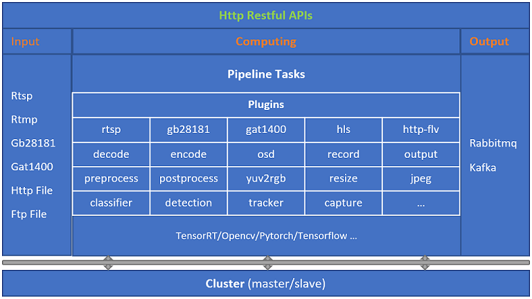
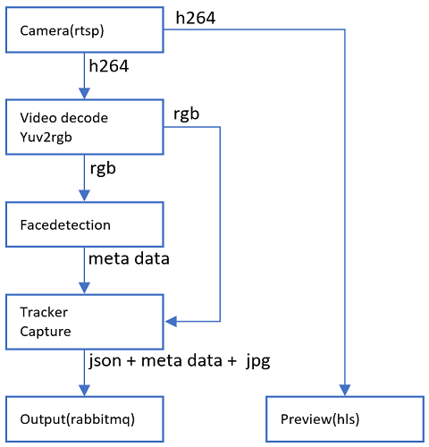
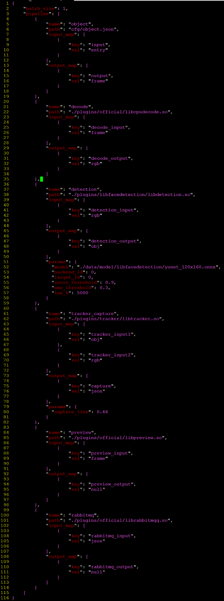

# aistream
为算法工程化而设计
****

## 架构

## 文档
[Restful API](http://124.222.53.156:8080/restfulapi)

## 客户端
[Web Client](http://124.222.53.156:8080/aistream)  
默认用户名/密码: admin/123456

## 特性
* [接口](#文本)
    * Restful API + json
* [输入](#文本)
    * 支持任何格式数据输入，视频、图片、音频、文本等
    * 支持rtsp，rtmp，gb28181，gat1400，websocket，ftp，hik/dahua sdk等
    * 支持互联网数据接入
* [输出](#文本)
    * 结构化数据，RabbitMQ/Kafka + json
* [算法](#文本)
    * 开箱即用，丰富的深度学习模型库，detector/classifier/tracker等，涉及人脸，姿态，声音，车辆，性别，年龄等
    * 支持用户算法模型导入，支持用户动态库函数模型导入，基于json的简单配置，pipeline机制
    * 一切插件化，高度可扩展性，可复用性，像搭积木一样开发产品，避免牵一发而动全身，快速满足用户多样性需求
* [视频预览](#文本)
    * 支持hls/http-flv/webrtc
* [集群](#文本)
    * 支持master/slave模式，自动负载均衡，无限扩展
    * 每个slave支持GPU一机多卡
    * 支持数据库参数持久化，用户只需要通过RESTful APIs配置一次，重启自动运行任务
* [客户端](#文本)
    * 提供一个基于vue框架的web client，支持实时视频预览、实时抓拍、图片识别、设备管理、任务管理、数据查询、集群管理等基本功能

## 测试步骤
### 1. 下载第三方依赖包
    链接：https://pan.baidu.com/s/1_acGS6FxyPRYPK9WTixHvA
    提取码：t3uo
    下载文件到相应目录。
### 2. 编译
    mkdir build
    cd build
    cmake ..
    make
### 3. 运行
    首先搭建rabbitmq服务器(假如IP为10.1.1.3)，如果没有可修改samples/face_detection.json把插件节点rabbitmq删除即可。
    启动服务: 
        ./aistream
### 4. Sample测试 -- 人脸检测/跟踪/抓拍
#### 流程图

#### 任务配置(pipeline)

#### 启动任务
    单机模式(访问某个slave默认端口15515):
        curl -d "{\"type\":\"mq\",\"data\":{\"host\":\"10.1.1.3\",\"port\":5672,\"username\":\"guest\",\"password\":\"guest\",\"exchange\":\"amq.direct\",\"routingkey\":\"\"}}" http://127.0.0.1:15515/api/system/set/output
        curl -d "{\"id\":99,\"data\":{\"tcp_enable\":0,\"url\":\"rtsp://127.0.0.1:8554/test.264\"}}" http://127.0.0.1:15515/api/obj/add/rtsp
        curl -d "{\"id\":99,\"data\":{\"task\":\"face_capture\"}}" http://127.0.0.1:15515/api/task/start
    集群模式(访问master默认端口11706):
        curl -d "{\"ip\":\"127.0.0.1\",\"rest_port\":15515,\"internet_ip\":\"\"}" http://127.0.0.1:11706/api/system/slave/add
        curl -d "{\"type\":\"mq\",\"data\":{\"host\":\"10.1.1.3\",\"port\":5672,\"username\":\"guest\",\"password\":\"guest\",\"exchange\":\"amq.direct\",\"routingkey\":\"\"}}" http://127.0.0.1:11706/api/system/set/output
        curl -d "{\"id\":99,\"data\":{\"tcp_enable\":0,\"url\":\"rtsp://127.0.0.1:8554/test.264\"}}" http://127.0.0.1:11706/api/obj/add/rtsp
        curl -d "{\"id\":99,\"data\":{\"task\":\"face_capture\"}}" http://127.0.0.1:11706/api/task/start

    正常运行的话，可以在rabbitmq客户端接收到如下结构化信息(http图片访问依赖nginx服务器，配置见cfg/config.json)：
    {
        "msg_type":     "common",
        "data": {
                "id":   99,
                "timestamp":    1652335593,
                "sceneimg":     {
                        "url":  "http://10.1.1.3:8090/image/20220512/99/1652335592_0_scene.jpg"
                },
                "object":       [{
                                "type": "face",
                                "trackId":      26167,
                                "x":    716,
                                "y":    520,
                                "w":    173,
                                "h":    199,
                                "url":  "http://10.1.1.3:8090/image/20220512/99/1652335592_0_obj.jpg"
                        }]
        }
    }

## 其他
### 1. nginx
#### 编译
    cd work/pkg
    tar xvzf nginx-1.22.0-http-flv-module.tar.gz
    cd nginx-1.22.0
    ./configure --add-module=/path/to/nginx-http-flv-module
    make
    sudo make install
#### 运行
    /usr/local/nginx/sbin/nginx
#### 配置
    修改aistream工程下cfg/config.json中nginx_path，与nginx安装目录一致，如"/usr/local/nginx"
### 2. mongodb
#### 安装
    集群运行及参数持久化依赖mongodb数据库，请自行安装.
#### 初始化配置
    非"用户名/密码"认证模式启动db server:
    mongod --config ./mongod.conf
    初始化"用户名/密码":
    mongo 127.0.0.1:27017
    > use aistream
    > db.createUser({user:"admin",pwd:"123456",roles:[{role:"root",db:"admin"}]})
    > quit()
    停止db server:
    mongod --config ./mongod.conf --shutdown
    "用户名/密码"认证模式启动db server:
    mongod --config ./mongod.conf --auth
### 3. 备注
#### 多输入
    如果模块有多个input，则input[0]需要连接到较慢的那个，参考samples/face_detection.json，tracker_input1必须连接到obj(目标检测，输入为rgb，且检测结果可能为0)，而不是rgb(每帧都有有效数据).
    

